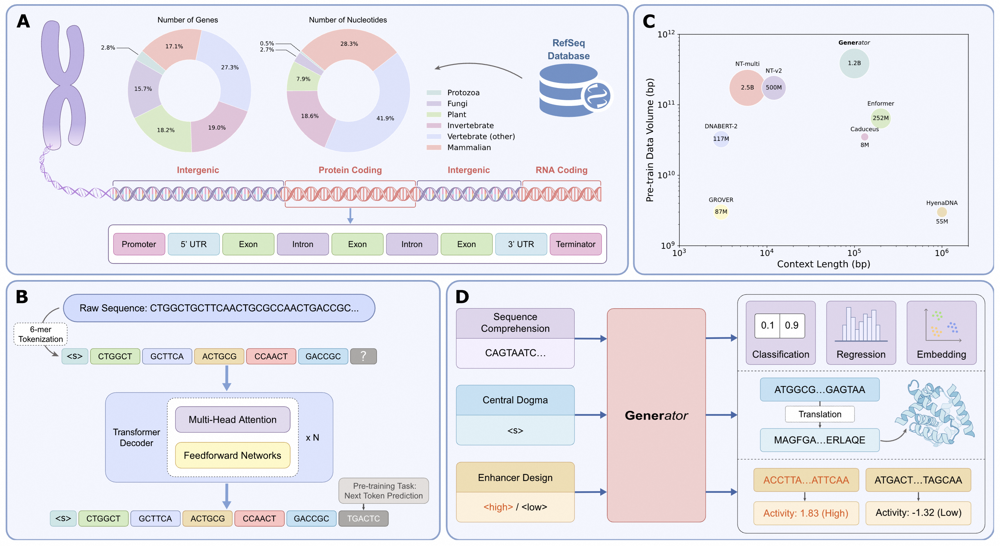

<p align="center">
  <picture>
    
  </picture>
</p>

<h1 align="center">GENERator: A Long-Context Generative Genomic Foundation Model</h1>

## 📰 News

* 🤗 **[2025-02-11]** We are pleased to announce that our models `GENERator-eukaryote-1.2b-base`,
  `GENERator-eukaryote-3b-base` are now available on [Hugging Face](https://huggingface.co/GenerTeam/)!
* 📑 **[2025-02-12]** Our paper has been made publicly available on [arXiv](https://arxiv.org/abs/2502.07272)!

## 🔭 Overview



In this repository, we present GENERator, a collection of generative genomic foundation models utilizing the transformer
decoder architecture, trained on expansive DNA datasets derived from
the [RefSeq database](https://www.ncbi.nlm.nih.gov/refseq/). Our evaluations demonstrate that the GENERator consistently
achieves state-of-the-art performance across a wide spectrum of benchmarks,
including [Genomic Benchmarks](https://huggingface.co/datasets/katielink/genomic-benchmarks/tree/main), [NT tasks](https://huggingface.co/datasets/InstaDeepAI/nucleotide_transformer_downstream_tasks_revised),
and our newly proposed [Gener tasks](https://huggingface.co/GenerTeam).

Beyond benchmark performance, the GENERator adheres to the central dogma of molecular biology, accurately generating
protein-coding DNA sequences that produce proteins structurally analogous to known families. Moreover, the GENERator
showcases significant promise in sequence optimization, particularly in the design of promoter sequences that regulate
gene activity during various biological stages, highlighting its potential for a series of biologically significant
tasks. Our findings position the GENERator as a vital resource for genomic research and biotechnological advancement. By
enhancing our capability to interpret and predict genomic sequences, the GENERator paves the way for profound
improvements in our understanding of complex biological systems and the development of precise genomic interventions.

For more technical details, please refer to our paper on [arXiv](https://arxiv.org/abs/2502.07272).

In this repository, you will find the following model checkpoints:

| Model Name                       | Parameters | Data  |          Category          |                                   Status                                    |
|----------------------------------|:----------:|:-----:|:--------------------------:|:---------------------------------------------------------------------------:|
| `GENERator-eukaryote-1.2b-base`  |    1.2B    | 386B  |         Eukaryote          | [Available](https://huggingface.co/GenerTeam/GENERator-eukaryote-1.2b-base) |
| `GENERator-eukaryote-3b-base`    |     3B     | 386B  |         Eukaryote          |  [Available](https://huggingface.co/GenerTeam/GENERator-eukaryote-3b-base)  |
| `GENERator-prokaryote-1.2b-base` |    1.2B    | 715B  |      Prokaryote+Virus      |                                 Coming soon                                 |
| `GENERator-prokaryote-1.2b-base` |     3B     | 715B  |      Prokaryote+Virus      |                                 Coming soon                                 |
| `GENERator-unified-7b-base`      |     7B     | 1101B | Eukaryote+Prokaryote+Virus |                            Awaiting sponsorship                             |

## 📈 Benchmark Performance


## 🎯 Quick Start

### Dependencies

* Clone this repo, cd into it

```shell
git clone https://github.com/GenerTeam/GENERator.git
cd GENERator
```

* Install requirements with Python 3.10

```shell
pip install -r requirements.txt
```

### Pre-train

coming soon...

### Downstream

#### Variant Effect Prediction

To run the variant effect prediction task on [clinvar](https://huggingface.co/datasets/songlab/clinvar), you can use the
following command:

```shell
# Using single GPU
python src/tasks/downstream/variant_effect_prediction.py

# Using multiple GPUs (Data Parallel)
python src/tasks/downstream/variant_effect_prediction.py --dp_size ${NUM_GPUS}
```

## 📚 Datasets

* [Gener Tasks](https://huggingface.co/datasets/GenerTeam/gener-tasks)

## 📜 Citation

```
@misc{wu2025generator,
      title={GENERator: A Long-Context Generative Genomic Foundation Model}, 
      author={Wei Wu and Qiuyi Li and Mingyang Li and Kun Fu and Fuli Feng and Jieping Ye and Hui Xiong and Zheng Wang},
      year={2025},
      eprint={2502.07272},
      archivePrefix={arXiv},
      primaryClass={cs.CL},
      url={https://arxiv.org/abs/2502.07272}, 
}
```
